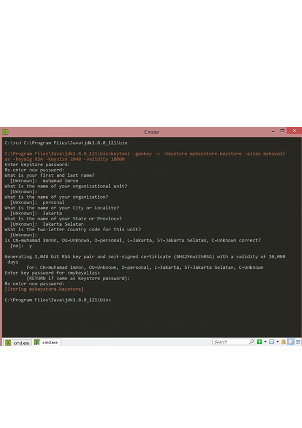
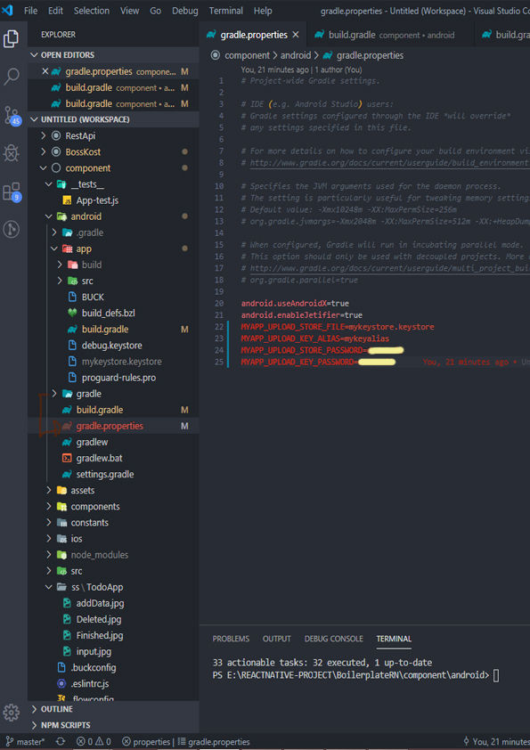
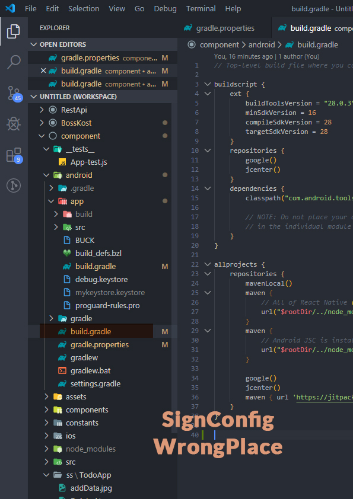
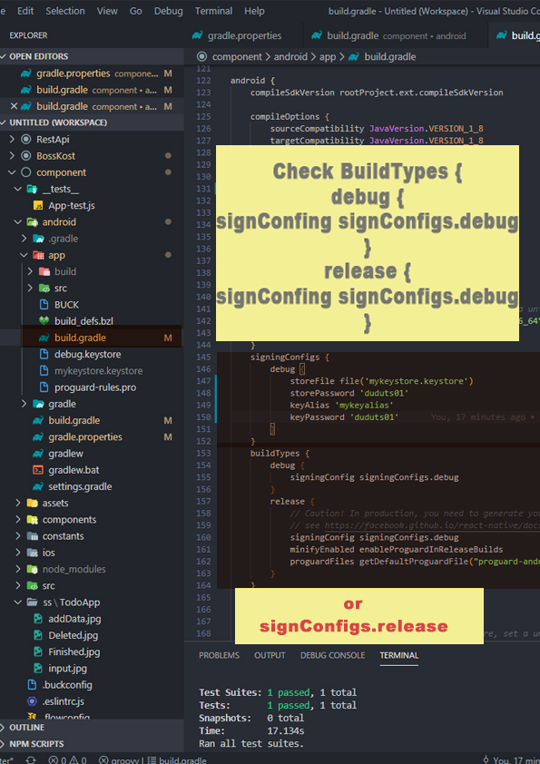
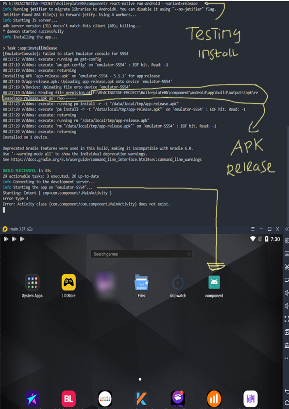
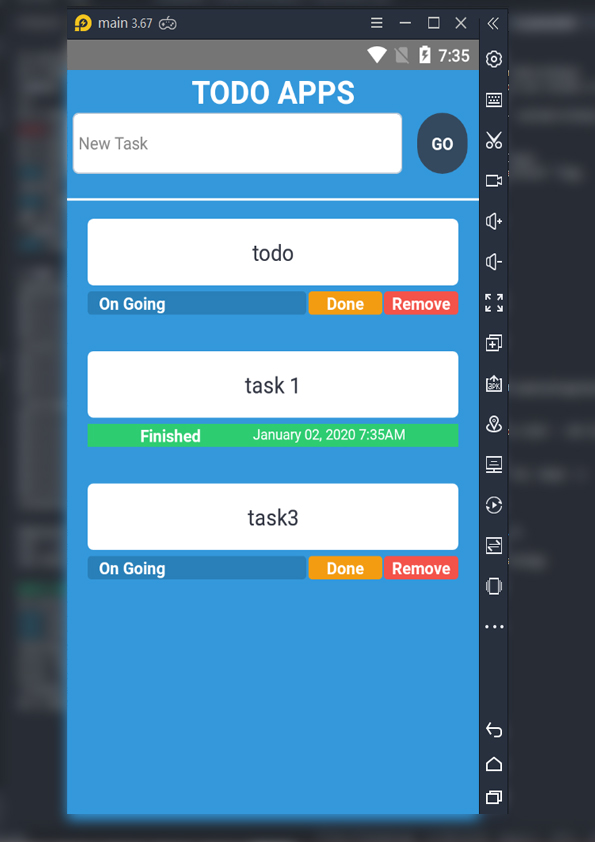

**GENERATE APK-RELEASE**

move to **jdk/bin** or **C:\\ProgramFile\\Java\\Jdkx.x.x_x\\bin** ,
generate(*dont forget admin prompt*) :

*keytool -genkeypair -v -keystore my-upload-key.keystore -alias my-key-alias
-keyalg RSA -keysize 2048 -validity 10000*

-   10000 validity mean 1000days

-   my-upload-key.keystore mean keystore

-   my-key-alias mean aliaskey & remember to take note of the alias

move file my-upload-key.keystore to *android/app, paste in folder app.*

Make Sure u do not Write in wrong build.gradle path

Set SignConfig file

GENERATE APK & TEST INSTALL TO REAL EMULATOR

**VOILAAA**

